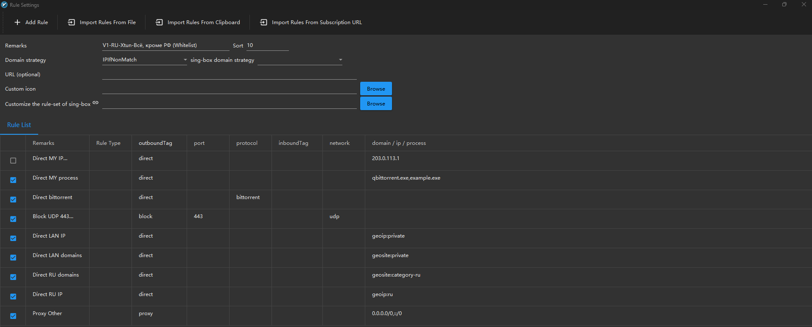

# v2rayN: правила для России под Xray TUN

**Русский** | [English](README.en.md)

Три набора правил маршрутизации для [v2rayN](https://github.com/2dust/v2rayN) в режиме **Xray TUN**.
Во всех наборах стратегия `IPIfNonMatch`. Правила опираются на geo-файлы
[runetfreedom](https://github.com/runetfreedom/russia-v2ray-rules-dat).
Готовые файлы лежат в [релизах](https://github.com/OushenView/v2rayn-ru-xraytun/releases).

| набор | в прокси | напрямую |
|---|---|---|
| Всё, кроме РФ (Whitelist) | всё зарубежное | российские домены и IP, локальная сеть, qBittorrent |
| Заблокированное (Blacklist) | заблокированное в РФ (`ru-blocked`), Discord, DNS и DoH Cloudflare и Google | всё остальное, qBittorrent |
| Всё (Global) | всё, кроме локальной сети | локальная сеть |

Во всех наборах QUIC (UDP/443) заблокирован: браузеры переходят на TCP, где Xray видит имя сайта.

В v2rayN к имени добавляется версия: `V1-RU-Xtun-Всё, кроме РФ (Whitelist)`. `V1` — версия
наборов, она же номер релиза.

Так выглядит набор Whitelist в v2rayN после импорта:



## Что нужно

- v2rayN 7.24.7 или новее с ядром Xray (проверено на 7.25.2). С 7.24.7 v2rayN запускает
  Xray TUN с `routeOnly`, и правила по IP видят реальный адрес назначения.
- TUN на ядре Xray. В «Настройки → Параметры → Настройки режима TUN» выключите
  «Устаревшая защита TUN (Legacy Protect)». С v2rayN 7.24.3 она по умолчанию включена,
  и тогда TUN работает через sing-box.
- Geo-файлы и DNS из пресета «Россия» — шаг 1 установки.
- v2rayN на компьютере. В v2rayNG на Android эти файлы как есть не подойдут. Правила
  по процессам там не находят пакетов Android, v2rayNG оставляет их без условий, и ядро
  не запускается с ошибкой `this rule has no effective fields`.

## Установка

> **Сначала пресет «Россия».** Правила используют категории `ru-blocked` и `category-ru`
> из geo-файлов runetfreedom. В стандартных geo-файлах v2rayN их нет, и без них ядро
> не запустится.

1. **Настройки → Настройка региональных пресетов → Россия.** v2rayN скачает geo-файлы
   и DNS runetfreedom. Заодно появятся их собственные наборы правил — их можно удалить.
2. **Настройки → Параметры → Настройки v2rayN → Источник правил маршрутизации.** Вставьте
   ссылку и сохраните:
   ```
   https://github.com/OushenView/v2rayn-ru-xraytun/releases/latest/download/template.json
   ```
3. **Настройки → Настройки маршрутизации → Импортировать правила.** Появятся три набора:
   `V1-RU-Xtun-Всё, кроме РФ (Whitelist)`, `V1-RU-Xtun-Заблокированное (Blacklist)`
   и `V1-RU-Xtun-Всё (Global)`.
4. Выберите нужный набор в главном окне или в меню в трее.

Импортируйте при подключённом прокси: v2rayN скачивает правила через него.

Если ядро не запускается с ошибкой про `ru-blocked`, значит, geo-файлы остались стандартными.
Повторите шаг 1 или обновите GeoFiles через «Обновить».

Один набор можно поставить и без шаблона. В «Настройках маршрутизации» создайте набор,
выберите «Доменная стратегия» `IPIfNonMatch`, в поле «URL (необязательно)» вставьте ссылку
на файл из релиза и нажмите «Импорт правил из URL». Ссылки на файлы последнего релиза:

```
https://github.com/OushenView/v2rayn-ru-xraytun/releases/latest/download/whitelist.json
https://github.com/OushenView/v2rayn-ru-xraytun/releases/latest/download/blacklist.json
https://github.com/OushenView/v2rayn-ru-xraytun/releases/latest/download/global.json
```

## Обновление

Сам v2rayN наборы не обновляет. Новые версии выходят
[релизами](https://github.com/OushenView/v2rayn-ru-xraytun/releases). Обновиться можно двумя способами:

- «Импортировать правила» ещё раз. Новая версия придёт с новым номером в имени
  (`V2-RU-Xtun-…`), старые наборы удалите.
- Одним набором: откройте его, вставьте в «URL (необязательно)» ссылку на его файл из релиза,
  нажмите «Импорт правил из URL» и на вопрос «Хотите добавить правила?» ответьте «Нет» —
  правила заменятся.

## Под себя

### Свои программы

В правилах `Direct MY process` (Whitelist и Blacklist) и `Proxy MY process` (Blacklist) рядом
с программами по умолчанию стоит заглушка `example.exe`. Замените её своими программами:
откройте набор в «Настройках маршрутизации», затем правило, и впишите имена в поле
«Процесс (Linux/Windows)» — по одному в строке или через запятую.

Имена регистрозависимы: пишите точно как на вкладке «Подробности» диспетчера задач
(`Discord.exe`, а не `discord.exe`).

Пример — игры и Steam напрямую, в `Direct MY process` набора Whitelist:

```
VALORANT-Win64-Shipping.exe
RiotClientServices.exe
vgc.exe
dota2.exe
cs2.exe
steam.exe
steamservice.exe
steamwebhelper.exe
```

Первые три — игра Valorant, клиент Riot и античит Vanguard, последние три — клиент Steam,
его служба и встроенный браузер. В Blacklist игры и так идут напрямую.

### Торренты

Правило `bittorrent` узнаёт только открытое рукопожатие. Шифрованные соединения, DHT
и UDP-трекеры оно пропускает, и в Whitelist они уйдут в прокси. Поэтому qBittorrent
отправлен напрямую по имени процесса. Если у вас другой клиент, допишите его в
`Direct MY process`.

### Свой сервер мимо туннеля

В Whitelist есть выключенное правило `Direct MY IP`. Впишите IP сервера и включите его,
если ходите на сервер по SSH или вложенным клиентом.

## Частые вопросы

**В логе `[Error] app/router: Unables to find local process name: common/net: not found`.**
Правила не сломаны. Так Xray сообщает, что Windows не выдала ему процесс, которому
принадлежит соединение. Одноразовые UDP-сокеты, например DNS-запросы, к этому моменту уже
закрыты. У TCP Xray смотрит только установленные соединения. У некоторых программ
с повышенными правами, например антивирусов, процесс тоже не находится. Правило
по процессу для такого соединения просто не срабатывает, и маршрутизация идёт дальше.
Процесс проверяет и служебное правило самого v2rayN в TUN, поэтому ошибка будет и без
наших правил, и без заглушки `example.exe`. Это известное ограничение Xray:
[#6588](https://github.com/XTLS/Xray-core/issues/6588),
[#6535](https://github.com/XTLS/Xray-core/issues/6535).

## Почему отдельные правила под Xray TUN

В режиме Xray TUN v2rayN сам включает `routeOnly`. Xray видит у каждого соединения реальный
IP назначения и отдельно имя сайта из SNI.

- **`IPIfNonMatch`, а не `IPOnDemand`.** При `IPIfNonMatch` правила по IP проверяют реальный
  адрес, без DNS-запросов. При `IPOnDemand` Xray для каждого соединения с именем сначала
  резолвит это имя и сверяет правила по IP с ответом DNS, а не с реальным адресом.
  Отсюда задержка на новых соединениях (если DNS не отвечает — 4 секунды) и промахи правил
  по IP там, где имя в SNI не совпадает с адресом, например у Reality с чужим SNI.
- **`IPIfNonMatch`, а не `AsIs`.** В чистом Xray TUN разницы нет: `AsIs` тоже обходится без
  DNS-запросов, правила по IP видят реальный адрес, правила по процессам работают так же.
  Разница там, где Xray видит только имя сайта: включена «Устаревшая защита TUN» (TUN держит
  sing-box и передаёт трафик в Xray без `routeOnly`), браузер ходит через системный прокси,
  программа настроена на SOCKS v2rayN или включён FakeIP. `AsIs` в этих случаях правила
  geoip молча пропускает: в Blacklist сайт, заблокированный по IP, уйдёт напрямую.
  `IPIfNonMatch` резолвит имя и проверяет geoip. Цена — один DNS-запрос на такое
  соединение, обычно из кэша.
- **Последнее правило — по IP** (`0.0.0.0/0`, `::/0`), а не по портам. В TUN оно срабатывает
  сразу, без DNS. Соединения, где известно только имя (системный прокси, SOCKS в программах),
  проходят второй круг: Xray резолвит имя и проверяет geoip-правила. Правило по портам
  в конце сработало бы на всё уже в первом проходе, и `IPIfNonMatch` превратился бы в `AsIs`.

## Благодарности

- [runetfreedom/russia-v2ray-rules-dat](https://github.com/runetfreedom/russia-v2ray-rules-dat) —
  geo-файлы (`ru-blocked`, `category-ru`) и пресет «Россия» в v2rayN
- [v2fly/domain-list-community](https://github.com/v2fly/domain-list-community)
- [2dust/v2rayN](https://github.com/2dust/v2rayN), [XTLS/Xray-core](https://github.com/XTLS/Xray-core)

## Лицензия

[MIT](LICENSE)
